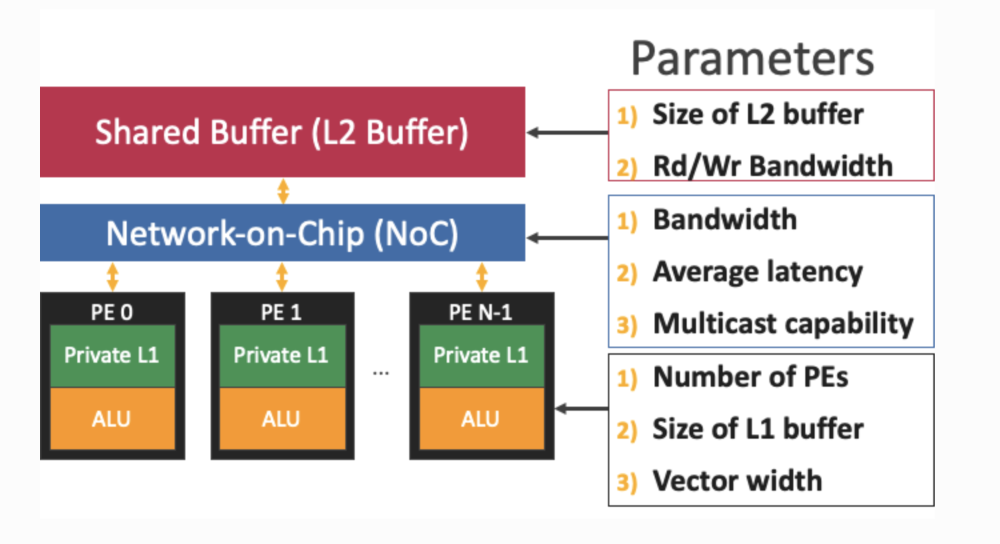
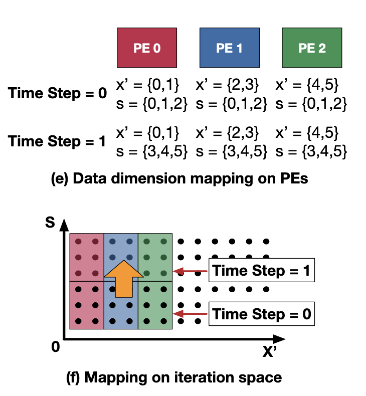
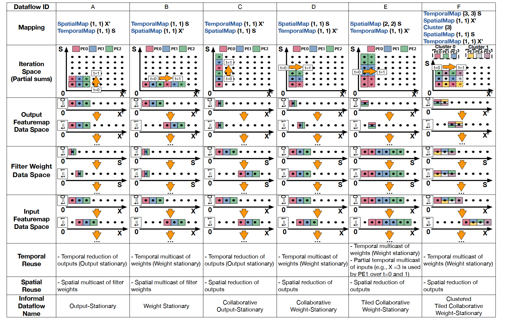

# Lab5

## 实验目的

- 了解 MAESTRO 的输入格式与运行方式（硬件描述 + mapping 描述）
- 理解 dataflow 指令（SpatialMap / TemporalMap / Cluster）对并行度与数据搬运的影响
- 了解如何通过输出结果判断瓶颈

## MAESTRO

本次实验使用 MAESTRO 进行 DNN dataflow 的性能/能耗建模分析，参考论文《Understanding Reuse, Performance, and Hardware Cost of DNN Dataflows: A Data-Centric Approach Using MAESTRO》，对应的 PDF 文件也已上传到 bb 平台。

**MAESTRO** 是一个用“数据流指令 + 硬件约束”来快速估计 DNN 层性能/能耗/带宽瓶颈的分析工具。

### 硬件架构

MAESTRO 支持由以下组件组成的 DNN 加速器架构：

- 一块全局共享的片上存储（类似 L2 scratchpad，所有 PE 共享）；
- 每个 PE 的本地片上存储（类似 L1 scratchpad，PE 私有）；
- 片上互连网络 NoC（负责 PE 与存储之间、PE 与 PE 之间的数据传输，如 multicast/reduction）；
- 一组 PE 阵列，而且这些 PE 可以按任意层次、任意维度组织（例如分 cluster、二维阵列、多级层次结构等）。

如下图所示：

<div align="center">
  
</div>

我们本次实验使用 MAESTRO 进行模拟，对应的硬件架构也如上图所示，其中的硬件规格参数可以进行配置。

### 数据流原语

<!-- MAESTRO 的三种数据流原语：
- `SpatialMap` 展开并行，提升吞吐，但可能提高 NoC/DRAM 带宽需求
- `TemporalMap` 按时间复用，降低带宽峰值，但可能降低并行度
- `Cluster` 把并行层次切成多级：上层在 cluster 间并行，下层在 cluster 内并行 -->

以下面一个 1D 卷积为例，来介绍 MAESTRO 中使用的三种原语

```cpp
for (x = 0; x < 12; x++) {
    for (s = 0; s < 6; s++) {
        O[x] += I[x + s] * W[s];
    }
}
```

将两层循环进行拆分：

```cpp
/* ------ */
for (x2 = 0; x2 < 2; x2++) {
    for (s2 = 0; s2 < 1; s2++) {
        /* ------ */
        par_for (x1 = 0; x1 < 3; x1++) {
            for (s1 = 0; s1 < 2; s1++) {
                /* ------ */
                for (x0 = 0; x0 < 2; x0++) {
                    for (s0 = 0; s0 < 3; s0++) {
                        s = s2 * 2 * 3 + s1 * 3 + s0;
                        x = x2 * 3 * 2 + x1 * 2 + x0;
                        O[x] += I[x + s] * W[s];
                    }
                }
            }
        }
    }
}
```

> par_for 表示该循环在不同 PE 上并行执行。

将 `s` 和 `x` 拆成三部分循环，可以看作，第一部分循环将 `s` 和 `x` 拆成大块，一大块中都是 6 个元素，
内部循环一次处理这 6 个元素，即时间维度上的广度展开（TemporalMap）；第二部分循环将 `x` 拆成 3 块，每块 2 个元素，在空间维度上展开（SpatialMap），将这 3 块分给不同 PE 并行处理（共三个 PE），并将 `s` 拆成 2 块，在时间维度上展开（TemporalMap）；第三部分循环表示每一个 PE 内部的计算。

具体分配如下图所示：

<div align="center">
  
</div>

可以看到，同一个时间步内，不同 PE 处理的权重是相同的，而不同输出位置分配给不同 PE 并行处理。不同时间步处理的权重不同，而输出位置是相同的，直至当前这些输出位置的计算完成。

可以发现这种循环嵌套的表示方式十分复杂，难以直观理解。为此，MAESTRO 提供了以数据为中心的表示方法，有以下三种原语：

- **SpatialMap(size, offset) dim**：把 `dim` 维度按 `size` 大小切块，分给不同 PE 并行处理，相邻 PE 处理的块的索引差值为 `offset`。
- **TemporalMap(size, offset) dim**：把 `dim` 维度按 `size` 大小切块分给一个 PE，在时间维度上展开，相邻时间步处理的块的索引差值为 `offset`。映射的块索引在同一个时间步内对所有 PE 是相同的。
- **Cluster(number)**：为了同时在多个维度上做空间并行，引入多级并行层次。将 `number` 个 PE 组成一个 cluster，在 cluster 间和 cluster 内分别进行空间分配。

上面提到的这个过程使用 MAESTRO 的 dataflow 指令表示为：

```
SpatialMap (2, 2) X
TemporalMap (3, 3) S
```

表示，把输出位置 `X` 按大小为 2 的块分给不同 PE 并行处理（共 3 个 PE），相邻 PE 处理的块的索引差值为 2，把权重 `S` 按大小为 3 的块在时间维度上展开。与上图表示一致。

下面以上述的 1D 卷积为例，介绍不同指令顺序、映射方法、分块大小等对数据流的影响。



- A：首先在空间维度上展开输出位置 `X`，然后在时间维度上展开权重 `S`。不同 PE 处理不同输出位置，相同时间步处理相同权重，不同的时间步处理相同的输出位置(直至当前这3个输出位置处理完)。

- B：首先在时间维度上展开权重 `S`，然后在空间维度上展开输出位置 `X`。首先处理相同的权重，直至遍历完所有输出位置(输出位置在空间维度展开，不同 PE 处理不同输出位置)。

- C：首先在时间维度上展开输出位置 `X`，然后在空间维度上展开权重 `S`。不同 PE 处理不同的权重。

- D：首先在空间维度上展开权重 `S`，然后在时间维度上展开输出位置 `X`。不同 PE 处理不同的权重，相同时间步处理相同的输出位置，不同的时间步处理相同的权重(直至当前这3个权重处理完)。

- E：与 D 类似，只是把 `S` 的映射大小改为 2。同一时间步内一个 PE 负责处理 2 个权重。这实现了输入的部分时间复用(为什么？其他几种数据流实现输入的时间复用了吗？)

- F：引入 Cluster，将 3 个 PE 组成一个 Cluster，同一个时间步内六个 PE 共同工作，在输出位置 `X` 维度和权重 `S` 维度上都实现了并行，即两级空间并行。

指令顺序可以理解为两个嵌套的 `for` 循环，只有内层 `for` 循环执行完毕，才会进入外层 `for` 循环的下一次迭代。因此 A 和 B 中交换了指令顺序，导致了不同的 stationary 行为。

> 不同的指令顺序以及不同的 size 大小会怎么影响数据的复用方式？根据硬件规格应该怎么选择指令顺序以及 size 大小？

这部分内容可以参考论文中的详细解释。

## 实验环境

关于 MAESTRO 的安装与使用，可以参考[官方文档](https://maestro.ece.gatech.edu/docs/build/html/index.html)。

### 部署 MAESTRO

本次实验推荐使用 Linux 操作系统(其他操作系统的部署步骤可能有所不同)，请参考以下步骤进行部署：

- 安装依赖：
  MAESTRO 依赖 g++，scons，libboost-all-dev，第一次实验中以及安装过 g++，下面给出以下两个依赖的安装命令：
  ```bash
  sudo apt update
  sudo apt install scons libboost-all-dev
  ```
  可以使用以下命令检查是否安装成功：
  ```bash
  scons --version
  dpkg -l | grep libboost
  ```

- clone MAESTRO 项目：
  ```bash
  git clone https://github.com/maestro-project/maestro
  ```

- 编译 MAESTRO：
  ```bash
  cd maestro
  scons
  ```

编译完成后，`./maestro` 可执行文件会生成在 `maestro` 目录下。

### 运行 MAESTRO

MAESTRO 的运行需要两个输入文件：
- 硬件描述文件（`.m` 后缀），描述硬件架构的规格参数(可见`data/hw/accelerator_1.m`)；
- mapping 描述文件（`.m` 后缀），描述 DNN 的 dataflow(可见`data/mapping/`目录)。

运行脚本可以参考 `run_example.sh`文件，其中 `HW_file` 参数指定硬件描述文件，`Mapping_file` 参数指定 mapping 描述文件。`print_res` 和 `print_res_csv_file` 参数分别指定是否打印结果和将结果保存为 CSV 文件。建议将二者都设为 true。

直接运行脚本即可得到 MAESTRO 的模拟结果：
```bash
./run_example.sh
```

运行结果会打印在终端中，并保存为 CSV 文件到根目录下，如 `Resnet50_kcp_ws.csv`。

可选：使用 `tools/jupyter_notebook/maestro_output_analysis.ipynb` 做图表分析。

## 实验内容

为了简化实验，本次实验中使用的硬件参数仅包含以下几项：

- num_pes
- l1_size_cstr
- l2_size_cstr
- noc_bw_cstr
- offchip_bw_cstr

只在单层卷积上进行实验。

### 实验一：固定硬件，修改 mapping

固定硬件配置如下：

```
num_pes: 256
l1_size_cstr: 100
l2_size_cstr: 3000
noc_bw_cstr: 1000
offchip_bw_cstr: 50
```

需要实现的卷积层参数如下：

```
Type: CONV
Stride { X: 1, Y: 1 }		
Dimensions { K: 128, C: 128, R: 3, S: 3, Y: 28, X: 28 }
```

请使用 MAESTRO 提供的三种原语来实现这个卷积层的数据流 mapping，并在此固定的硬件规格下优化 mapping，以使得 runtime 最小化。

你需要在实验报告中解释为什么你是如何基于模拟结果来优化 mapping 的(比如 `l1_size_cstr` 过小时，可以减小分块的大小以减少数据过度搬运的开销)，并分析当前的主要瓶颈是什么（compute / NoC / off-chip / buffer）。

### 实验二：固定 mapping，修改硬件参数

给定数据流 mapping 如下：

```
Network SimpleConv {
    Layer CONV1 {
		Type: CONV
		Stride { X: 1, Y: 1 }		
		Dimensions { K: 64, C: 64, R: 3, S: 3, Y: 56, X: 56 }
		Dataflow {
			SpatialMap(1,1) K;
			TemporalMap(64,64) C;
			TemporalMap(Sz(R),Sz(R)) R;
			TemporalMap(Sz(S),Sz(S)) S;
			TemporalMap(Sz(R),1) Y;
			TemporalMap(Sz(S),1) X;	
			Cluster(64, P);
			SpatialMap(1,1) C;
			TemporalMap(Sz(R),1) Y;
			TemporalMap(Sz(S),1) X;
			TemporalMap(Sz(R),Sz(R)) R;
			TemporalMap(Sz(S),Sz(S)) S;
		}
	}
}
```

给出以下硬件参数配置可选：

- num_pes $\in$ {64, 128, 256, 512}
- noc_bw_cstr $\in$ {128, 256, 512, 1024}
- offchip_bw_cstr $\in$ {50, 100, 200, 300, 500}
- l1_size_cstr $\in$ {64, 128, 256, 512}
- l2_size_cstr $\in$ {4096, 8192, 16384, 32768}

每个候选值都有一个点数成本，如下：

- num_pes: 64(0),128(1),256(2),512(3)
- noc_bw: 128(0),256(1),512(2),1024(3)
- offchip: 50(0),100(1),200(2),300(3),500(4)
- l1: 64(0),128(1),256(2),512(3)
- l2: 4096(0),8192(1),16384(2),32768(3)

总成本 $cost = cost_{pes} + cost_{noc} + cost_{off} + cost_{l1} + cost_{l2}$

例如，选择 num_pes=256, noc_bw=512, offchip=200, l1=256, l2=8192，则总成本为 $2 + 2 + 2 + 2 + 1 = 9$。

我们给的硬件规格成本预算为 8，请在预算内选择硬件规格参数，使得 runtime 最小化。

你需要在实验报告中解释为什么你是如何基于模拟结果来调整硬件参数的，并分析当前的主要瓶颈是什么（compute / NoC / off-chip / buffer）。

## 提交要求

你需要将两个实验中完成的 mapping 文件和硬件描述文件，以及实验报告打包在一起并压缩到 zip 格式，命名格式为 `学号_姓名_lab5.zip`，上传到 bb 平台。

实验报告中需要包含以下内容：

- 实验一中你尝试的不同 mapping 方案及其模拟结果，以及你是如何基于这些结果来优化 mapping 的，最终的 mapping 文件是什么，当前的主要瓶颈是什么。

- 实验二中你尝试的不同硬件参数配置及其模拟结果，以及你是如何基于这些结果来调整硬件参数的，最终的硬件描述文件是什么，当前的主要瓶颈是什么。


<span style="color:red; font-weight:bold;">提交截止时间</span>：北京时间 1 月 31 日 23:59。
