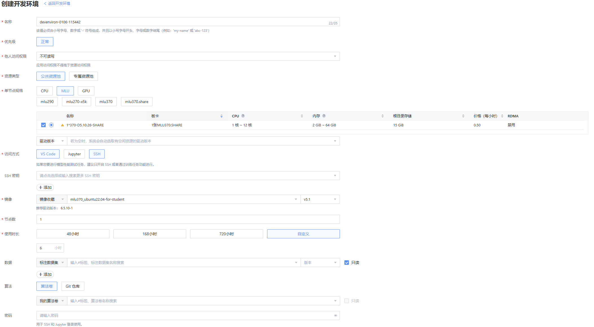

# Lab6

## 实验目的

- 了解寒武纪 MLU 的基本编程模型与存储层次
- 掌握开发编译 BANG C/C++ Kernel 的基本流程
- 了解如何进行算子优化

## Bang C/C++

BANG C/C++ 是寒武纪 MLU 设备的编程语言，类似于 CUDA C++。BANG C 提供了一套丰富的 API 用于在 MLU 上实现高性能计算。通过 BANG C/C++，开发者可以编写自定义的 Kernel 来实现特定的计算任务，并利用 MLU 的并行计算能力提升性能。

关于 MLU 设备的一些基本概念以及 BANG C 的编程模型，可以参考课程讲解以及寒武纪官方文档[Cambricon BANG C/C++ 编程指南](https://www.cambricon.com/docs/sdk_1.15.0/cntoolkit_3.7.2/programming_guide_1.7.0/index.html)，关于 API 的使用，可以参考[Cambricon BANG C Developer Guide](https://www.cambricon.com/docs/sdk_1.15.0/cntoolkit_3.7.2/cambricon_bang_c_4.7.2/index.html)。

下面以一个向量加法的例子来说明 BANG C/C++ Kernel 的基本开发方法，以及如何进行一些初步的优化。

### 2.1 单核标量加法

```cpp
__mlu_global__ void kernel(float *output, const float *a,
                           const float *b, int32_t data_num) {
  if (nullptr == output || nullptr == a || nullptr == b || 0 >= data_num) {
    return;
  }

  for (int32_t i = 0; i < data_num; i++) {
    output[i] = a[i] + b[i];
  }
}
```

这段程序定义了一个简单的向量加法 Kernel。`__mlu_global__` 关键字表示这是一个在 MLU 上运行的全局函数。函数接受三个指针参数，分别指向输出数组和两个输入数组，以及一个整数参数表示数据的数量。函数内部通过一个循环遍历每个元素，执行加法操作。这个实现是最基本的形式，没有进行任何优化。

这个 Kernel 使用单核处理，并且从 GDRAM 中逐元素读取数据进行计算，并写回 GDRAM。

使用以下代码调用这个 Kernel：

```cpp
kernel<<<dim, func_type, queue>>>(dst_mlu, src1_mlu, src2_mlu, ELEM_NUM);
```

由于只使用了单核，为 BLOCK 类型，一些设置如下：

```cpp
cnrtDim3_t dim;
cnrtFunctionType_t func_type;

func_type = CNRT_FUNC_TYPE_BLOCK;
dim->x = 1;
dim->y = 1;
dim->z = 1;
```

### 2.2 多核标量加法

```cpp
__mlu_global__ void kernel(float *output, const float *a,
                           const float *b, int32_t data_num) {
  if (__is_mpu()) {
    return;
  }

  if (nullptr == output || nullptr == a || nullptr == b || 0 >= data_num) {
    return;
  }

  int32_t data_per_core = data_num / taskDim;
  int32_t data_last_core = data_per_core + data_num % taskDim;
  const float *a_offset = a + taskId * data_per_core;
  const float *b_offset = b + taskId * data_per_core;
  float *output_offset = output + taskId * data_per_core;

  if (taskId == taskDim - 1) {
    data_per_core = data_last_core;
  }
  for (int32_t i = 0; i < data_per_core; i++) {
    output_offset[i] = a_offset[i] + b_offset[i];
  }
}
```

这段程序对之前的单核标量加法进行了改进，支持多核处理。通过检查 `__is_mpu()` 函数，确保代码只在非 MPU 核心上执行。每个核心根据其 `taskId` 计算出自己需要处理的数据范围，并进行加法操作。这样可以充分利用 MLU 的多核并行计算能力，提高计算效率。

这个 Kernel 使用多核处理，为 UNION1 类型，以一个 Cluster 为单位，每个 Cluster 内部使用多个 Core 进行计算。一些设置如下：

```cpp
cnrtDim3_t dim;
cnrtFunctionType_t func_type;

func_type = CNRT_FUNC_TYPE_BLOCK;
dim->x = get_core_num_per_cluster();
dim->y = get_cluster_num();
dim->z = 1;
```

### 2.3 单核向量加法

由于 MLU 的最小计算单元为 Core，而每个 Core 内部支持向量化计算，因此可以通过向量化来提升单核的计算性能。下面的代码展示了如何实现单核向量加法：

```cpp
__nram__ uint8_t nram_buffer[MAX_NRAM_SIZE];

__mlu_global__ void kernel(float *output, const float *a,
                           const float *b, int32_t data_num) {
  if (nullptr == output || nullptr == a || nullptr == b || 0 >= data_num) {
    return;
  }

  int32_t align_num = NFU_ALIGN_SIZE / sizeof(float);
  int32_t data_nram_num =
    MAX_NRAM_SIZE / sizeof(float) / 2 / align_num * align_num;
  float *a_nram = (float *)nram_buffer;
  float *b_nram = (float *)a_nram + data_nram_num;
  int32_t loop_num = data_num / data_nram_num;
  int32_t rem_nram_num = data_num % data_nram_num;

  for (int32_t i = 0; i < loop_num; i++) {
    __memcpy(a_nram, a + i * data_nram_num,
             data_nram_num * sizeof(float), GDRAM2NRAM);
    __memcpy(b_nram, b + i * data_nram_num,
             data_nram_num * sizeof(float), GDRAM2NRAM);
    __bang_add(a_nram, a_nram, b_nram, data_nram_num);
    __memcpy(output + i * data_nram_num, a_nram,
             data_nram_num * sizeof(float), NRAM2GDRAM);
  }
  if (rem_nram_num != 0) {
    int32_t rem_align_num =
      (rem_nram_num + align_num - 1) / align_num * align_num;
    __memcpy(a_nram, a + loop_num * data_nram_num,
             rem_nram_num * sizeof(float), GDRAM2NRAM);
    __memcpy(b_nram, b + loop_num * data_nram_num,
             rem_nram_num * sizeof(float), GDRAM2NRAM);
    __bang_add(a_nram, a_nram, b_nram, rem_align_num);
    __memcpy(output + loop_num * data_nram_num, a_nram,
           rem_nram_num * sizeof(float), NRAM2GDRAM);
  }
}
```

这里使用内置函数 `__bang_add` 来实现向量化加法操作。首先，将数据从 GDRAM 传输到 NRAM，然后使用向量化指令进行加法计算，最后将结果写回 GDRAM。通过这种方式，可以显著提升单核的计算性能。

需要注意的是，NRAM 的大小有限，并且需要手动管理内存空间，如本例中，在 NRAM 中先放置输入数据 a，再放置输入数据 b。即

```cpp
float *a_nram = (float *)nram_buffer;
float *b_nram = (float *)a_nram + data_nram_num;
```

并且需要对齐！对齐大小为 `NFU_ALIGN_SIZE`。

### 2.4 单核三级流水线向量加法

为了进一步提升单核的计算性能，可以采用三级流水线的方式来重叠数据传输和计算。

三级流水线的基本思路是将数据传输和计算分为三个阶段：加载数据、计算数据和存储结果。通过在不同的时间点同时进行这些操作，可以最大化地利用计算资源和内存带宽。

三级流水线的 NRAM 中需要分配两块区域，分别储存两轮的数据，NRAM 布局如下：

```+-------------------+
|   a_nram_0       |
+-------------------+
|   b_nram_0       |
+-------------------+
|   a_nram_1       |
+-------------------+
|   b_nram_1       |
+-------------------+
```

定义三个函数，分别用于加载数据、计算数据和存储结果：

```cpp
// load in pipeline
__mlu_func__ void load(float *a_nram, const float *a, float *b_nram,
                       const float *b, int32_t data_nram_num, int32_t i) {
  mluMemcpyDirection_t direction = GDRAM2NRAM;
  int32_t offset = i % 2 * data_nram_num * 2;
  __memcpy_async(a_nram + offset, a + i * data_nram_num,
                 data_nram_num * sizeof(float), direction);
  __memcpy_async(b_nram + offset, b + i * data_nram_num,
                 data_nram_num * sizeof(float), direction);
}

// compute in pipeline
__mlu_func__ void compute(float *a_nram, float *b_nram,
                          int32_t data_nram_num, int32_t i) {
  int32_t offset = i % 2 * data_nram_num * 2;
  __bang_add(a_nram + offset, a_nram + offset, b_nram + offset, data_nram_num);
}

// store in pipeline
__mlu_func__ void store(float *output, float *a_nram,
                        int32_t data_nram_num, int32_t i) {
  mluMemcpyDirection_t direction = NRAM2GDRAM;
  int32_t offset = i % 2 * data_nram_num * 2;
  __memcpy_async(output + i * data_nram_num, a_nram + offset,
                 data_nram_num * sizeof(float), direction);
}
```

对于剩余部分的数据，可以单独处理：

```cpp
// load in pipeline
__mlu_func__ void load_rem(float *a_nram, const float *a, float *b_nram,
                           const float *b, int32_t data_nram_num,
                           int32_t rem_nram_num, int32_t loop_num, int32_t i) {
  mluMemcpyDirection_t direction = GDRAM2NRAM;
  int32_t offset = i % 2 * data_nram_num * 2;
  __memcpy_async(a_nram + offset, a + loop_num * data_nram_num,
                 rem_nram_num * sizeof(float), direction);
  __memcpy_async(b_nram + offset, b + loop_num * data_nram_num,
                 rem_nram_num * sizeof(float), direction);
}

// compute in pipeline
__mlu_func__ void compute_rem(float *a_nram, float *b_nram,
                              int32_t data_nram_num, int32_t rem_align_num,
                              int32_t i) {
  int32_t offset = i % 2 * data_nram_num * 2;
  __bang_add(a_nram + offset, a_nram + offset, b_nram + offset, rem_align_num);
}

// store in pipeline
__mlu_func__ void store_rem(float *output, float *a_nram, int32_t data_nram_num,
                            int32_t rem_nram_num, int32_t loop_num, int32_t i) {
  mluMemcpyDirection_t direction = NRAM2GDRAM;
  int32_t offset = i % 2 * data_nram_num * 2;
  __memcpy_async(output + loop_num * data_nram_num, a_nram + offset,
                 rem_nram_num * sizeof(float), direction);
}
```

此时的 Kernel 中一些初始设置如下：

```cpp
if (nullptr == output || nullptr == a || nullptr == b || 0 >= data_num) {
  return;
}

int32_t align_num = NFU_ALIGN_SIZE / sizeof(float);
int32_t data_nram_num = MAX_NRAM_SIZE / sizeof(float) / 4 / align_num * align_num;
float *a_nram = (float *)nram_buffer;
float *b_nram = a_nram + data_nram_num;

int32_t loop_num = data_num / data_nram_num;
int32_t rem_nram_num = data_num % data_nram_num;
int rem_num = 0;
int32_t rem_align_num = (rem_nram_num + align_num - 1) / align_num * align_num;
if (rem_nram_num != 0) {
  rem_num = 1;
}
```

接着启动三级流水线：

```cpp
for (int i = 0; i < loop_num + 2 + rem_num; i++) {
  if (i >= 2) {
    if (i < loop_num + 2 + rem_num - 1 || rem_num == 0) {
      store(output, a_nram, data_nram_num, i - 2);
    } else if (rem_num == 1) {
      store_rem(output, a_nram, data_nram_num, rem_nram_num, loop_num, i - 2);
    }
}
if (i >= 1 && i < loop_num + 1 + rem_num) {
  if (i < loop_num + 1 + rem_num - 1 || rem_num == 0) {
    compute(a_nram, b_nram, data_nram_num, i - 1);
  } else if (rem_num == 1) {
    compute_rem(a_nram, b_nram, data_nram_num, rem_align_num, i - 1);
  }
}
if (i < loop_num + rem_num) {
  if (i < loop_num + rem_num - 1 || rem_num == 0) {
    load(a_nram, a, b_nram, b, data_nram_num, i);
  } else if (rem_num == 1) {
    load_rem(a_nram, a, b_nram, b, data_nram_num, rem_nram_num, loop_num, i);
  }
}
  __sync_all_ipu();
}
```

对于第 i 轮迭代($i \geq 2$)，会执行存储操作，将第 (i-2) 轮计算的结果写回 GDRAM；执行计算操作，计算第 (i-1) 轮加载的数据；执行加载操作，加载第 i 轮的数据。

对于前两轮，流水线并没有完全填满，最后两轮也没有完全排空，因此需要多循环两次来完成所有的数据传输和计算。

这里需要注意的是，为了将计算与访存进行重叠，需要使用异步内存拷贝函数 `__memcpy_async` 后，还需要使用 `__sync_all_ipu()` 来确保所有的异步操作完成，才能进行下一步的计算或访存操作。

### 2.5 多核向量加法

为了利用 MLU 的多核计算能力，可以将上述的单核向量加法扩展到多核。每个核心处理自己分配到的数据块，使用向量化指令进行计算。

一些初始设置如下：

```cpp
if (__is_mpu()) {
  return;
}

if (nullptr == output || nullptr == a || nullptr == b || 0 >= data_num) {
  return;
}

int32_t data_per_core = data_num / taskDim;
int32_t data_last_core = data_per_core + data_num % taskDim;
const float *a_offset = a + taskId * data_per_core;
const float *b_offset = b + taskId * data_per_core;
float *output_offset = output + taskId * data_per_core;

if (taskId == taskDim - 1) {
  data_per_core = data_last_core;
}

int32_t align_num = NFU_ALIGN_SIZE / sizeof(float);
int32_t data_nram_num = MAX_NRAM_SIZE / sizeof(float) / 2 / align_num * align_num;
float *a_nram = (float *)nram_buffer;
float *b_nram = (float *)a_nram + data_nram_num;
int32_t loop_num = data_per_core / data_nram_num;
int32_t rem_nram_num = data_per_core % data_nram_num;
```

接着对于每一个 Core 都使用向量加法处理自己的数据块：

```cpp
for (int32_t i = 0; i < loop_num; i++) {
  __memcpy(a_nram, a_offset + i * data_nram_num,
           data_nram_num * sizeof(float), GDRAM2NRAM);
  __memcpy(b_nram, b_offset + i * data_nram_num,
           data_nram_num * sizeof(float), GDRAM2NRAM);
  __bang_add(a_nram, a_nram, b_nram, data_nram_num);
  __memcpy(output_offset + i * data_nram_num, a_nram,
           data_nram_num * sizeof(float), NRAM2GDRAM);
}
if (rem_nram_num != 0) {
  int32_t rem_align_num = (rem_nram_num + align_num - 1) / align_num * align_num;
  __memcpy(a_nram, a_offset + loop_num * data_nram_num,
           rem_nram_num * sizeof(float), GDRAM2NRAM);
  __memcpy(b_nram, b_offset + loop_num * data_nram_num,
           rem_nram_num * sizeof(float), GDRAM2NRAM);
  __bang_add(a_nram, a_nram, b_nram, rem_align_num);
  __memcpy(output_offset + loop_num * data_nram_num, a_nram,
           rem_nram_num * sizeof(float), NRAM2GDRAM);
}
```

### 2.6 多核三级流水线向量加法

多核三级流水线向量加法结合了多核处理和三级流水线技术。每个核心独立运行一个三级流水线的向量加法 Kernel，处理自己分配到的数据块。

加载、计算、存储函数与单核三级流水线中的一样，这里不再给出代码。

将单核三级流水线的 Kernel 包装成一个函数 `add`，代码一致，此处不再赘述。

Kernel 代码如下，对于每一个核心，都调用 `add` 函数来处理自己分配到的数据块：

```cpp
__mlu_entry__ void kernel(float *output, const float *a,
                          const float *b, int32_t data_num) {
  if (__is_mpu()) {
    return;
  }

  if (nullptr == output || nullptr == a || nullptr == b || 0 >= data_num) {
    return;
  }

  int32_t task_dim = taskDim;
  int32_t task_id = taskId;
  int32_t data_per_core = data_num / task_dim;
  int32_t data_last_core = data_per_core + data_num % task_dim;

  const float *a_offset = a + task_id * data_per_core;
  const float *b_offset = b + task_id * data_per_core;
  float *output_offset = (float *)output + task_id * data_per_core;

  if (task_id != task_dim - 1) {
    add(output_offset, a_offset, b_offset, data_per_core);
  } else {
    add(output_offset, a_offset, b_offset, data_last_core);
  }
}
```

## 实验环境

本次实验需要在[南京智能计算中心算力平台](https://paas.extrotec.com:30443/auth/login)上完成。

登录账号为大家在教务系统中登记的邮箱，密码默认是 Extrotec@123。

### 3.1 使用方法

#### 3.1.1 创建开发环境

登录平台后，在左侧导航栏点击“训练管理”->“开发环境”，进入开发环境页面。

点击“创建开发环境”按钮，可以参考如下图所示的配置：



选择 MLU 资源，mlu370 对应的镜像，以及合适的使用时长。

> 注意：在启动后，到达使用时长后，开发环境会自动关闭，容器中的数据会丢失，重新启动环境后，容器会恢复到初始状态，因此请提前备份好数据。

#### 3.1.2 连接开发环境

启动开发环境后，可以根据创建开发环境时的访问方式，来选择对应的连接方法。

如选择 SSH，可以使用 ssh 连接到该容器，具体命令以及密码可以在创建得到的开发环境页面查看。

实验平台相关细节可以参考[南京智能计算中心算力平台使用指南](https://paas.extrotec.com:30443/docs/guide/training/dev_environ.html)。

## 实验内容

### 4.1 实验任务

由于本次实验涉及到的 Kernel 只有一个，为了简化代码文件，将 Host 端代码与 Device 端代码可以放在同一个 mlu 文件中完成。

`matmul.mlu` 文件中给出了最简单的矩阵乘法的 Kernel 实现，较为低效。

可以通过以下命令编译并运行可执行文件：

```bash
bash run.sh
```

大家可以使用合适的优化方法来优化 Kernel 的性能。

> 注意：由于给出的版本十分低效，因此为了保证运行时间较短，选择的矩阵大小的规模仅为 256 x 256。在优化后，可以适当增加矩阵的规模来测试性能。

### 4.2 提交要求

你需要在实验报告中附上你的优化思路，在优化前后进行性能对比。

请将你的代码文件和实验报告打包到一个 zip ⽂件中（学号_姓名.zip），并将该 zip ⽂件提交到 bb 平台上。

<span style="color:red; font-weight:bold;">提交截止时间</span>：北京时间 1 月 31 日 23:59。
